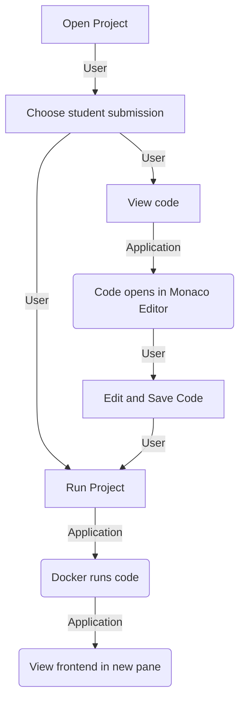
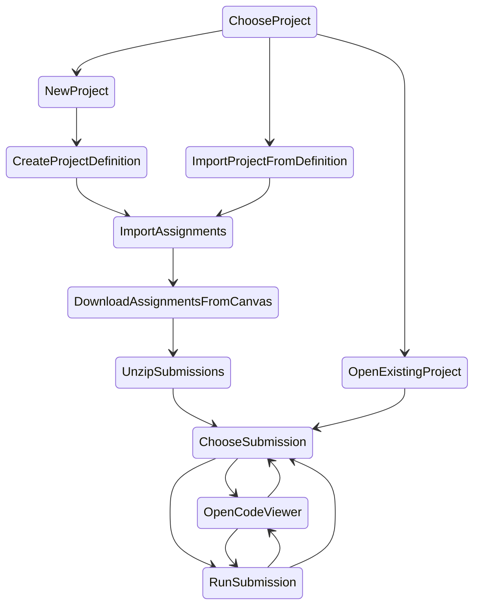

# React Frontend

## UX Diagram

```mermaid
flowchart TD
    A[Open Project] -- User --> B[Choose student submission]
    B -- User --> C[Run Project]
    B -- User --> D[View code]
    C -- Application --> E(Docker runs code) -- Application --> F(View frontend in new pane)
    D -- Application --> G(Code opens in Monaco Editor)
    G -- User --> H[Edit and Save Code]
    H -- User --> C
```

## React State Diagram

```mermaid
stateDiagram-v2
    ChooseProject --> NewProject
    ChooseProject --> ImportProjectFromDefinition
    ChooseProject --> OpenExistingProject

    NewProject --> CreateProjectDefinition
    CreateProjectDefinition --> ImportAssignments

    ImportProjectFromDefinition --> ImportAssignments
    ImportAssignments --> DownloadAssignmentsFromCanvas
    DownloadAssignmentsFromCanvas --> UnzipSubmissions
    UnzipSubmissions --> ChooseSubmission
    OpenExistingProject --> ChooseSubmission
    ChooseSubmission --> OpenCodeViewer
    OpenCodeViewer --> ChooseSubmission
    ChooseSubmission --> RunSubmission
    OpenCodeViewer --> RunSubmission
    RunSubmission --> OpenCodeViewer
    RunSubmission --> ChooseSubmission
    
```